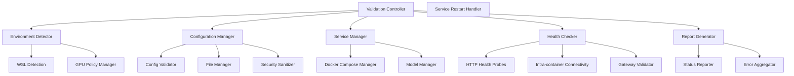
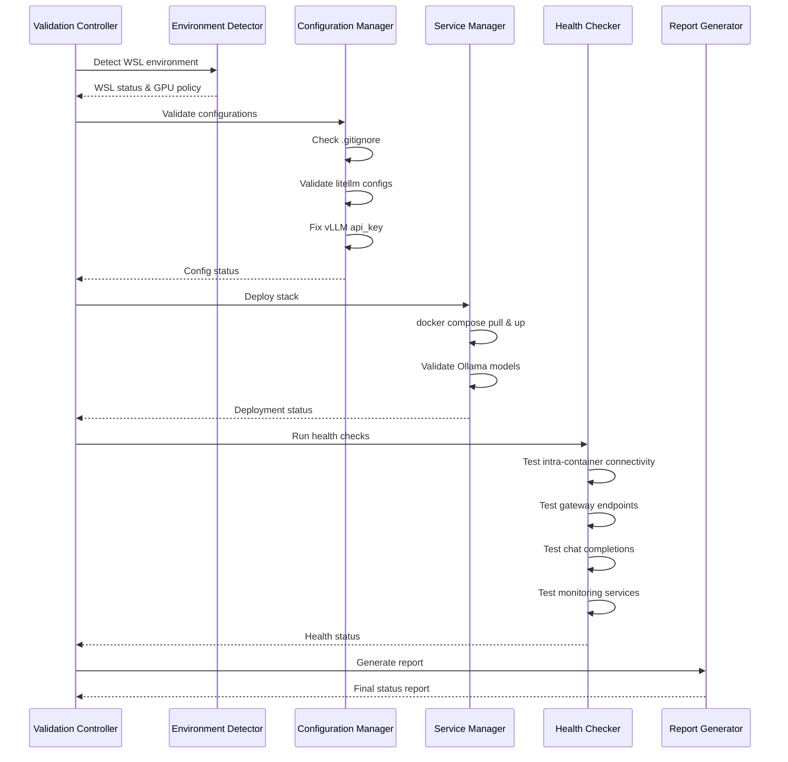

# Design Document

## Overview

The AI Stack Validation and Hardening system is designed as a comprehensive validation framework that systematically checks, configures, and validates a multi-service AI infrastructure stack. The system follows a phased approach: environment detection, configuration hygiene, service deployment, model readiness, health validation, and reporting. It's architected to be WSL-aware, avoiding GPU-dependent operations while ensuring full stack functionality through HTTP-based health checks.

## Architecture

### System Components



### Execution Flow



## Components and Interfaces

### Environment Detector

**Purpose:** Detects runtime environment and sets appropriate validation policies.

**Interface:**
```python
class EnvironmentDetector:
    def detect_wsl() -> bool
    def get_gpu_policy() -> GPUPolicy
    def should_skip_gpu_tests() -> bool
```

**Implementation Details:**
- Reads `/proc/sys/kernel/osrelease` to detect WSL
- Returns GPU policy based on environment
- Provides skip flags for GPU-dependent operations

### Configuration Manager

**Purpose:** Validates and fixes configuration files for security and functionality.

**Interface:**
```python
class ConfigurationManager:
    def validate_gitignore() -> ValidationResult
    def ensure_sample_config() -> ValidationResult
    def fix_vllm_config() -> ValidationResult
    def sanitize_secrets(config: dict) -> dict
```

**Implementation Details:**
- Creates `.gitignore` with required entries if missing
- Generates sanitized sample config from live config
- Adds missing `api_key: "EMPTY"` to vLLM configurations
- Replaces secrets with placeholders in sample files

### Service Manager

**Purpose:** Manages Docker Compose stack deployment and Ollama model availability.

**Interface:**
```python
class ServiceManager:
    def deploy_stack() -> DeploymentResult
    def validate_models() -> ModelValidationResult
    def restart_service(service_name: str) -> RestartResult
```

**Implementation Details:**
- Executes `docker compose pull && docker compose up -d`
- Checks for required Ollama models and pulls missing ones
- Provides selective service restart capabilities
- Tracks service states to avoid unnecessary restarts

### Health Checker

**Purpose:** Performs comprehensive HTTP-based health validation of all stack components.

**Interface:**
```python
class HealthChecker:
    def check_intra_container_connectivity() -> ConnectivityResult
    def validate_gateway() -> GatewayResult
    def test_chat_completions() -> ChatResult
    def check_monitoring_services() -> MonitoringResult
```

**Implementation Details:**
- Tests Ollama and vLLM connectivity from LiteLLM container
- Validates `/v1/models` endpoint returns proper data structure
- Tests both Ollama and vLLM chat completion routes
- Checks Dozzle and cAdvisor accessibility
- Implements retry logic with service restart on failure

### Report Generator

**Purpose:** Aggregates validation results and generates comprehensive status reports.

**Interface:**
```python
class ReportGenerator:
    def generate_service_table() -> ServiceTable
    def list_available_models() -> ModelList
    def show_chat_excerpts() -> ChatExcerpts
    def calculate_disk_usage() -> DiskUsage
    def format_final_report() -> StatusReport
```

## Data Models

### Validation Result
```python
@dataclass
class ValidationResult:
    success: bool
    message: str
    details: Optional[dict] = None
    remediation_hint: Optional[str] = None
```

### Service Status
```python
@dataclass
class ServiceStatus:
    name: str
    container_name: str
    status: str  # "running", "stopped", "error"
    ports: List[str]
    health: str  # "healthy", "unhealthy", "unknown"
```

### Health Check Result
```python
@dataclass
class HealthCheckResult:
    service: str
    endpoint: str
    success: bool
    response_time: float
    error_message: Optional[str] = None
    retry_count: int = 0
```

### GPU Policy
```python
@dataclass
class GPUPolicy:
    skip_gpu_tests: bool
    validate_config_only: bool
    environment: str  # "wsl", "native", "docker"
```

## Error Handling

### Retry Strategy
- **HTTP Failures:** Restart specific service once, then retry health check
- **Model Pull Failures:** Retry up to 3 times with exponential backoff
- **Configuration Errors:** Attempt automatic fix, fallback to manual intervention required

### Error Recovery
```python
class ErrorRecovery:
    def handle_service_failure(service: str, error: Exception) -> RecoveryAction
    def capture_service_logs(service: str, lines: int = 50) -> str
    def suggest_remediation(error_type: str, context: dict) -> str
```

### Failure Modes
1. **Service Won't Start:** Capture logs, suggest configuration review
2. **Model Download Timeout:** Suggest manual pull or network check
3. **Health Check Timeout:** Suggest resource constraints or network issues
4. **Configuration Corruption:** Restore from sample, suggest manual review

## Testing Strategy

### Unit Tests
- **Environment Detection:** Mock `/proc/sys/kernel/osrelease` for WSL/native scenarios
- **Configuration Management:** Test file operations with temporary directories
- **Health Checks:** Mock HTTP responses for various success/failure scenarios
- **Report Generation:** Validate output formatting and data accuracy

### Integration Tests
- **Docker Compose Integration:** Test with minimal stack configuration
- **End-to-End Validation:** Full stack deployment in test environment
- **WSL Compatibility:** Validate GPU test skipping in WSL environment
- **Error Recovery:** Simulate service failures and validate recovery

### Test Data
```python
# Mock service responses
MOCK_OLLAMA_RESPONSE = "Ollama is running"
MOCK_VLLM_MODELS = {"data": [{"id": "gemma-3-4b-it"}]}
MOCK_CHAT_COMPLETION = {"choices": [{"message": {"content": "Hello"}}]}

# Test configurations
TEST_LITELLM_CONFIG = {
    "model_list": [
        {
            "model_name": "test-model",
            "litellm_params": {
                "model": "openai/test",
                "api_base": "http://vllm:8000/v1"
            }
        }
    ]
}
```

### Performance Considerations
- **Parallel Health Checks:** Run independent health checks concurrently
- **Timeout Management:** Set appropriate timeouts for model downloads and health checks
- **Resource Monitoring:** Track memory and CPU usage during validation
- **Caching:** Cache model availability checks to avoid repeated Docker exec calls

### Security Considerations
- **Secret Sanitization:** Ensure all secrets are properly masked in sample configs
- **File Permissions:** Maintain proper file permissions when creating/modifying configs
- **Container Isolation:** Respect container boundaries during health checks
- **Log Sanitization:** Remove sensitive information from captured logs